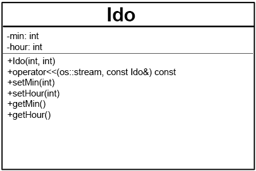
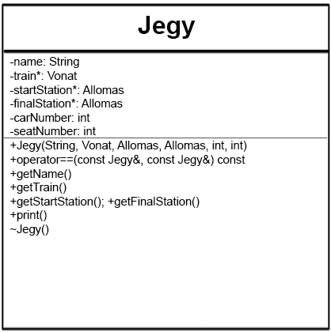
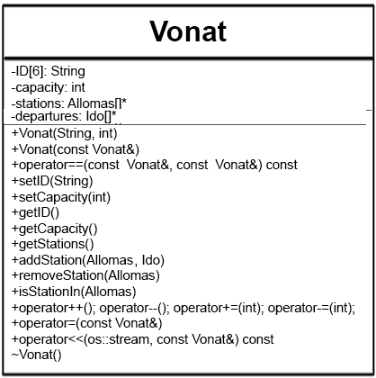
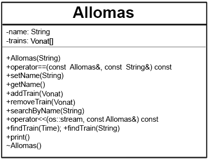
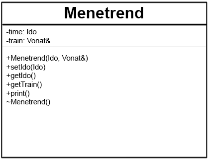

# Házi feladat

### Programozás alapjai 2

### Bánszky Koppány - KK4UWP

# Vonatjegy

## Feladat

Tervezze meg egy vonatjegy eladó rendszer egyszerűsített objektummodelljét, majd valósítsa azt meg! A vonatjegy a feladatban mindig jegyet és helyjegyet jelent együtt. Így egy jegyen minimum a következőket kell feltüntetni:

- vonatszám, kocsiszám, hely  
- indulási állomás, indulási idő  
- érkezési állomás, érkezési idő

A rendszerrel minimum a következő műveleteket kívánjuk elvégezni:

- vonatok felvétele  
- jegy kiadása  

A rendszer később lehet bővebb funkcionalitású (pl. késések kezelése, vonat törlése, menetrend, stb.), ezért nagyon fontos, hogy jól határozza meg az objektumokat és azok felelősségét.
Valósítsa meg a jeggyel végezhető összes értelmes műveletet operátor átdefiniálással (overload), de nem kell ragaszkodni az összes operátor átdefiniálásához! A megoldáshoz ne használjon STL tárolót!

## Specifikáció

A program kiinduló pontja egy menü. Itt 3 opció közül lehet választani, a megfelelő billentyűk lenyomásával. Mind a 3 opció megjelenik a képernyőn:

- Jegyvásárlás (`j`)
- Vonat felvétele (`n`)
- Állomás felvétele (`s`)

### Jegyvásárlás

A jegyvásárlás menüponton belül az alábbi működés legyen érvényes:  

  1. Be kell írni egy, az indoló állomás nevét a keresőbe. A bemenetnek ne legyen karakter korlátja, illetve a továbbiakban se legyen szöveg bemenetnek karakterkorlátja. (Ezt nem fogom mindig kiemelnni)
  1. A kimenetre sorolja fel az összes olyan állomást, ami a bemenethez hasonló. Ha nincs semmilyen hasonlóság, jelezze a felhasználó felé és kérje újra a keresést. Balra, az állomásnév mellett legyen 1-n-ig sorszámozva a felsorolás.
  1. A megfelelő szám beírásával véglegesíthető a kiinduló állomás
  1. Ugyan ezt ismételje az érkezési állomáshoz.
  1. Miután mindkét állomás megnevezésre került, listázza a kimenetre az elérhető járatokat. Jelenjen meg a járatszám, indulási, érkezési idő, valamint ugyancsak bal oldalt 1-n ig számozás.
  1. Szintén a megfelelő szám beírásával lehet választani.
  1. Választás után a bemenetre kérjen egy teljes nevet, majd minden paraméterével mutassa meg a jegyet a kimenet. Helyet sorsol, viszont ha a vonat megtelt, jelzi azt a kimeneten.

### Vonat felvétele

A vonatok felvétele a következőképp zajlik:

1. A menüben meg kell adni egy vonat azonosítót, amely maximum 6 karaktert tartalmazhat.
1. Ezután meg kell adni hány kocsival fog közlekedni az adott járat. (Egy kocsi általánosítva 35 fővel bír.)
1. Minden állomás egy 1-n ig tartó számozással megjelenik a kimeneten. A számokat egymás után beírva lehet megadni, hogy a árat hol közlekedik. Minden szám beírása után meg kell adni az adott állomásról az indulás időpontját `18:50`-es formátumban.
1. A végállomás után -1 beírásával lehet menteni.

### Állomás felvétele

Az állomásfelvételekor csupán egy nevet kell megadni, amivel lehet az állomásra hivatkozni. Ha az adott név már létezik, jelezze a kimeneten és kérjen újat.

A bevitt adatokat a program hosszútávon tárolja, nem vesznek el a leállítást követően.


## Terv

### Objektumok és feladatkörök

### Ido

Az `Ido` objektum feladatköre a menetrendekben az idő tárolása.

Tárolt adatai: óra, perc

A `<<` operátor írja ki az időt a következő formátumban: `18:05`

<p align="center">
  
</p>


### Jegy

A `Jegy` objektum a jegyek kezeléséért, tárolásáért, megjelenítésért felel.

Tartalmazzon pointert a megfelelő vonatra, pointert a kezdő és cél állomásra, valamint egy Stringet a névhez. Ezen felül a helyjegy értelmében egy kocsi, illetve egy ülés számot is.

A string dinmaikusan foglalt területen legyen.

A print függvény írjon ki minden adatot a jegyről. (Név, vonat, cél-, végállomás, indulás, érkezés ideje.)

<p align="center">
  
</p>


### Vonat

A `Vonat` objektumban tárolom az azonosítóját, kapacitását (kocsik száma), illetve egy listát az érintett állomásokról. A redundancia elkerülése érdekében ezek legyenek pointerek.

Ne legyen alap konstruktor, kötelező megadni azonosítót, kapacitást (ennek default értéke 3), valamit az állomásokat.

Mivel az azonosító maximum 6 karakter hosszú lehet, nem kell dinamikusan tárolni.

Legyen minden adattárolóhoz megfelelő getter és setter.

A print() függvény írja ki a következő adatokat a megfelelő formában: [ ID | Kiinduló állomás: `állomás` | Végállomás: `végállomás` | Szabad helyek: `num` ]

A `<<` operátor csak az azonosítót írja ki egy kapott os stream-re.

A `-=` operátor a kapacitást csökkentse megfelelelő int-el.
Ehhez természetesen csatolni kell a másoló konstruktort és operátort, a `-` és `--` operátorokat. Illetve eleganciából a `+` és `+=` operátorokat, bár ennek egyelőre nincs kimondott haszna. (Elgondolkodtató, hogy ezek inkább nevesített függvényként legyenek megvalósítva, a félreértések elkerülése végett)


<p align="center">
  
</p>


### Allomas

Az `Allomas` osztály feladata egy állomás és az abban közlekedő, az őt érintő menetrend kezelése.

Az `==` operátor a pontos névegyezésre térjen vissza `true`-val, a `searchByName` pedig minimum 4 karakteres egyezéssel térjen vissza az egyezések számával.

```cpp
std::string nev;
std::string keresett;

ciklus keresett utolsó karakterétől 4-ig [j]:
    ciklus 0-tól nev utolsó karakterig [i]:
        HA keresett[0:j] == nev[i:i+j]:
            return j;
        EGYÉBKÉNT HA keresett[keresett.hossz-j:keresett.hossz] == nev[i:i+j]:
            return j;
    ciklus vége
ciklus vége

return 0;
```


<p align="center">
  
</p>


<!-- 
### Menetrend

Legyen a `Menetrend` az állomásokon a vonatok indulásának kezelésért felelős.

Az osztályban az indulás időpontját és az adott vonatra egy referenciát tároljon.

Legyen egy print függvénye, ami kiírja az indulás időpontját, a vonat azonosítóját és az állomást.


<p align="center">
  
</p>


 -->
